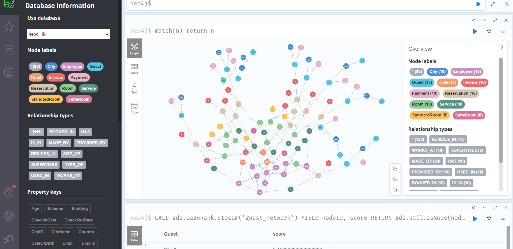

<h1 align="center">Hi 👋, I'm Sanjog Adhikari</h1>
<h3 align="center">Data Analyst | ICT Support Engineer</h3>

  
  
  
  
  
  

  Turning data into insights and delivering reliable ICT support solutions.

---

## 💡 About Me

- 🎓 Master’s in Information Systems & Data Science  
- 📊 Focused on data analysis, dashboards, and reporting  
- 🖥 Hands-on experience in ICT support, Microsoft 365, and device setup  
- 🌱 Continuously growing skills in Azure and enterprise IT environments  

---

## 🛠 Skills

### 📊 Data & Analytics
- Python • SQL • Power BI • Excel  
- Data Cleaning • Visualization • Reporting  

### 🖥 ICT / IT Support
- Microsoft 365 (Users, Mailboxes, Basic Admin)  
- Windows 10/11 Troubleshooting  
- Hardware • Printers • Peripherals  
- Networking Basics • PoE • Access Points  
- Azure Fundamentals (AZ-900)

---

## 🚀 Featured Projects

🔹 **NT Crime Dashboard**  
Power BI dashboard analyzing crime trends in the Northern Territory.

🔹 **Twitter Data Analysis**  
Python-based analysis to uncover trends and insights from Twitter data.

🔹 **Neo4j Graph Database Project**  
Graph data modeling and relationship analysis using Neo4j.

🔹 **Portfolio Website**  
Personal website showcasing projects and technical experience.

---

## 🖼 Project Previews

  <b>🐦 Twitter Data Analysis</b> 
  

  <b>🔗 Neo4j Graph Database Project</b> 
  

---

## 📊 GitHub Stats

  

---

⭐ Always learning, building, and improving through practical projects.

---

